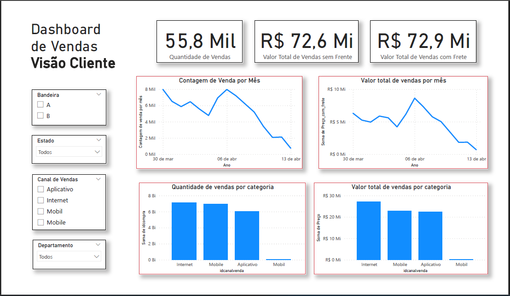

## Sales Report and Financial Model in Power BI  

This repository contains interactive Power BI files and a complementary PDF documenting sales performance and financial insights. These files were created to provide a clear and concise view of customer demographics, sales trends, and financial modeling.  

### 📂 Files in This Repository  
- **`financial-model.pbit`**: A reusable template for financial analysis, allowing users to plug in their data and generate insights.  
- **`sales-report.pbix`**: A detailed sales report showcasing key metrics, visualizations, and filters.  
- **`sales-report-documentation.pdf`**: A static PDF summarizing the main insights and visualizations from the sales report for easy sharing.  

---

### 📊 Key Features of the Sales Report  

#### Customer Demographics:  
- **Age Distribution**: Breakdown of customer ages.  
- **Income Distribution**: Average income and income ranges of customers.  
- **Customer Count by State**: Total customers categorized by their state of birth.  

#### Sales Performance:  
- **Sales Count and Total Sales Value**:  
  - Monthly trends visualized through line charts.  
  - Category-wise distribution displayed in bar charts.  
- **Payment Methods**: Analysis of payment card types ("A" and "B").  

#### Filters for Exploration:  
- **State**: Filter data by customer state of birth.  
- **Sales Channel**: Narrow down data based on the channel through which sales were made.  
- **Department**: Analyze sales by specific departments.  

---

### 🎯 Purpose of the Financial Model  
The **`financial-model.pbit`** file serves as a template for performing financial analyses. It allows users to build on the provided structure, connect their own data sources, and generate actionable insights.

---

### 📸 Visual Previews  

#### Dashboard Overview  
  

#### Monthly Sales Trends  
  

#### Category-wise Sales  
  

---

### ⚙️ How to Use  

1. **For the Sales Report**:  
   - Open `sales-report.pbix` in **Power BI Desktop** to explore the interactive dashboard.  
   - Use the filters to narrow down specific insights.  

2. **For the Financial Model**:  
   - Open `financial-model.pbit` in **Power BI Desktop**.  
   - Connect it to your data sources to generate customized financial reports.  

3. **For the PDF Documentation**:  
   - Open `sales-report-documentation.pdf` to view a summarized version of the sales report.  

---

### 📝 Notes  
- Sample data was used to create the sales report and financial model to maintain data confidentiality.  
- To adapt the templates for your use, connect them to your own data sources in Power BI.  

---
